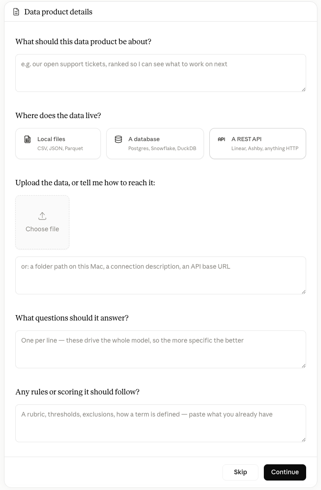

# Nexty desktop user guide

**For analysts working in Claude Cowork.**

Nexty Desktop builds a data product from an analysis you already do by hand. You connect a source, work through the definitions with Claude until the numbers are right, then package that as something you can query again later.

Asking the packaged data product uses the definitions you already agreed to, so the same question returns the same result.

---

## Contents

- [Quickstart](#quickstart)
- [How it works](#how-it-works)
- [Phase 1: Bring a job to be done](#phase-1-bring-a-job-to-be-done)
- [Phase 2: Work the problem](#phase-2-work-the-problem)
- [Phase 3: Package it](#phase-3-package-it)
- [Phase 4: Reuse it](#phase-4-reuse-it)
- [Key concepts](#key-concepts)
- [Prompt cookbook](#prompt-cookbook)
- [When something goes wrong](#when-something-goes-wrong)
- [Where things live](#where-things-live)
- [What to do next](#what-to-do-next)

---

## Quickstart

### Install

Nexty Desktop ships two builds: `macos-arm64` for Apple silicon Macs, and
`linux-aarch64` for ARM64 Linux, which is the one Cowork's environment needs.
Neither is an Intel build.

The steps below are the Mac install, Linux is similar.

1. **Download the Nexty Desktop distribution** named `nxd-desktop-x.y.z-macos-arm64.command` from [the releases page](https://github.com/nextdata-tech/nexty-agent-skills/releases#release-v0.49.1).
2. **Double-click it.** macOS refuses to open it and warns that it cannot verify
   the developer. That is expected: the installer is not signed yet. Dismiss the
   warning.
3. **Open System Settings, then Privacy & Security.** Scroll down to the Security
   section. There is a line saying the file was blocked, with an **Open Anyway**
   button beside it. Click that, confirm with your password or Touch ID, then
   click **Open** in the dialog that follows.
4. **Wait.** A terminal window opens and runs the install by itself. You do not
   have to type anything into it.

Steps 2 and 3 are only for the first install. macOS remembers the file after
that, and this goes away entirely once the installer is signed.

When it finishes, that window tells you what is left to do:

1. Check that the nxd-desktop connector is in Claude.
2. In Claude Desktop, open **Settings → Customize → Plugins → Add marketplace**.
3. Enter `nextdata-tech/nexty-agent-marketplace`, enable **Sync automatically**,
   and click **Sync**.
4. Add **Nexty Desktop** from the marketplace, then restart Claude.

The connector and the plugin do different jobs, which is why you need both. The
connector is how Claude reaches the engine on your Mac. The plugin is what
teaches Claude how to build a data product. The public marketplace contains
only the Desktop plugin and keeps it synchronized with the Desktop skill source.

If Claude cannot reach the marketplace, use the versioned ZIP bundled with the
installer as an offline fallback: open **Settings → Customize → Plugins → Add
plugin → Upload plugin** and choose `~/.nxd-desktop/nexty-desktop-vx.y.z.zip`.

### Run

Quit Claude and open it again after adding the plugin, then start a new chat.
Ask for what you want in your own words, or run `/nxd-run-job-loop`.

Once the job loop starts, you should see a screen that looks like this:



Not all questions are required. Give as much guidance as you can. The more you give, the faster it will be to get a correct answer.

For example, if you want to analyze weather data, you might say the data product is about `Weather analysis` and the question to answer is:

> I want to analyze the last 30 days of weather in zip code 94941 to see which days of the week are the sunniest. Use the Open Meteo Weather API.

Claude will ask some clarifying questions. Iterate on the plan until you feel it's complete, then say
"plan approved, build the data product". Congratulations, you just built a data product.

---

## How it works

Nexty works in four phases, and the sequence matters: each one depends on the one before it.

```
   PHASE 1          PHASE 2           PHASE 3           PHASE 4
   Bring            Work              Package           Reuse

   a job you   →    it with      →    it up        →    it without
   already do       Claude            so it can         redoing the
   by hand          until it's        repeat            work again
                    right
```

**[Phase 1](#phase-1-bring-a-job-to-be-done): Bring a job to be done.** Something real you've done at least once manually. You know what the right answer looks like, because you've produced it before.

**[Phase 2](#phase-2-work-the-problem): Work the problem.** Iterate with Claude in a session. Try things, get them wrong, correct definitions, argue about edge cases. Each question in this phase reads your source and derives the answer again, so it is the expensive phase in both time and tokens.

**[Phase 3](#phase-3-package-it): Package it.** When the answer is right and you expect to need it again, Nexty records what you settled on, your source, your definitions and your rules, and builds it into a **data product**.

**[Phase 4](#phase-4-reuse-it): Reuse it.** Claude asks the packaged data product a specific question and reads back a small table of results. It does not read your source again or work the logic out again, so you are no longer paying to settle a definition you already checked.

### What packaging changes

| | Working the problem | Packaged |
| --- | --- | --- |
| What Claude does | Reads your source and derives the answer | Sends a structured query, reads the result |
| What drives the cost | The size of your data and the reasoning | The size of the result |
| Repeatability | Depends on how you phrased it that day | Runs against the definition you verified |
| How long it takes | Varies with how much has to be worked out | Varies with the question, usually much shorter |

Build and query time still depend on your data, your machine, and what you ask for. Packaging saves you from working the answer out again. It does not make asking free.

Exploring is the right way to *find* an answer. It's not a great way to *keep getting* one. A monthly report you rebuild by conversation works the whole answer out twelve times a year, and can drift each time.

**A rule of thumb:** explore freely, and the moment you catch yourself about to do the same reasoning a second time, consider packaging it.

---

## Phase 1: Bring a job to be done

What you bring matters more than what data you have. A repeatable job with a known expected result is a strong candidate.

**A good candidate:**

- You've done it before, by hand. You know what the right answer looks like.
- You'll do it again: monthly, weekly, every time a deal closes, every board meeting.
- You can state what it means. Not perfectly, but you can say "revenue excludes refunds" out loud.
- Getting it wrong would matter to someone.

**A bad candidate:**

- A one-off curiosity you'll never repeat. Just ask Claude; don't build anything.
- Something you've never done, so you can't tell a right answer from a plausible one.
- A question with no stable definition, where the answer moves because the question does.

Describe the job and the rules that govern it. This is a good brief:

> Every month I produce revenue by region and product category with the top 20 customers, excluding refunds and internal test accounts. It takes me half a day. Last month came to $4.2M.

Note what's in it: the outcome, the rules, the cadence, and a number you can check against.

### Telling Nexty where the data is

Nexty does not go looking for data on its own, and it will not assume it can reach a database or an API because a question sounds analytical. You identify the source and supply what is needed to reach it: a connection, a file path, an API address. From there Nexty inspects the source, profiles its structure, and works out the rest with you.

It builds against:

- **Databases**: Snowflake, Postgres, and MySQL.
- **APIs**, including internal services and third-party ones.
- **Files and exports**, as long as they sit on the machine Nexty runs on.

In Cowork this last point matters. A file attached to the session lives in Cowork's workspace, which is not where the build runs. For a build, Nexty needs a file on your own machine, or a connection.

Once a source is connected, ask what's in it:

> Look at our warehouse and tell me what's in the sales schema.

If it needs a credential or a connection detail, it asks for that specific thing and nothing more. Credentials stay on your machine.

---

## Phase 2: Work the problem

Every correction you make here is one you would otherwise make every time you ran the job.

Talk to Claude the way you'd brief a colleague. Give it the target you already know. Then push back on what comes out:

> That top customer is a duplicate. We have them under two account IDs.

> You're including our own staging environment orders. Those aren't real.

> Growth should be year over year, not against last quarter.

Ask it to show its reasoning when a number surprises you:

> Walk me through what that's counting.

**Don't skip ahead to packaging.** A packaged data product built on a definition you hadn't finished hashing out is worse than none at all. It makes a wrong number repeatable.

You'll notice this phase can be slow and each question costs real tokens. That's expected. The work you do here is what packaging saves you from repeating.

---

## Phase 3: Package it

When the answer is right:

> This is right. Turn it into something I can reuse.

### The blueprint

Before building anything, Nexty writes out the plan it intends to follow. We call it the **data product blueprint**: plain English, your job written down. It covers what the data product is for, what questions it answers, what your terms mean, what rules always apply, and anything Nexty couldn't work out without you.

You don't need to understand its structure, but if you're curious about the details, you can review the blueprint at any time. You can check two things:

1. **Your corrections are in it.** Everything you argued about while working the problem should be written down here. If you told Claude that refunds don't count and there's nothing about refunds in the blueprint, say so now.
2. **The open questions are answered.** Nexty lists what it couldn't resolve on its own. These are the assumptions that will quietly shape every future answer.

It's yours to change:

> "Enterprise account" should mean ACV over $50k **or** headcount over 1,000, not both.

> Add a note that we haven't decided how to treat the EMEA account merge.

### Approving

> That's right. Build it.

Approving means you agree with the description read back to you, not that you audited a file. You are asked to confirm before the build actually runs, before anything is built.

The build takes a few minutes. Nexty reads your source, builds the data product, runs it, and checks it. It is the work you would otherwise repeat every time you asked.

---

## Phase 4: Reuse it

### Asking

> What was revenue by region last quarter?

> Top 10 customers by revenue, this year versus last.

> Northeast versus Southwest, month by month.

Claude shows you what it actually asked the data product alongside the answer. **Read that part.** If your question and its query don't match, say so and it'll correct.

### Coming back later

Close your laptop, come back in three weeks, new session:

> Open my orders data product and show me last week's revenue.

Nexty finds the data product and reconnects, usually in seconds and without rebuilding. If the built artifact is no longer there, it rebuilds from what it saved, and your terms, rules, and decisions come back either way.

### Sharing

The blueprint you approved in phase 3 is saved with the data product, as markdown, in the data product's own folder. That is the document to hand someone: what the data product is for, the questions it answers, what your terms mean, the rules that always apply, and what it promises.

> Give me the blueprint for this data product.

Email it, post it, attach it to a deck. It answers "where does this number come from?" without a meeting, and it reads as plain text anywhere.

### When the job changes

It will. Revenue gets redefined, a region splits, a new product line appears. Drop back to phase 2 for the bit that changed:

> Marketplace revenue needs to be reported separately from direct now. Update the data product.

Nexty amends the blueprint, shows you what changed, and rebuilds. You are not starting over.

---

## Key concepts

Six ideas worth knowing when you review a data product.

### Measures and dimensions

A **measure** is a number: revenue, order count, average basket size, days to close.

A **dimension** is a way of slicing it: region, month, product category, rep, segment.

Every question is some measures cut by some dimensions. "Revenue by region last quarter" is one measure, one dimension, one filter. Nexty builds this vocabulary from your data and your questions, and the data product answers in those terms.

> What can I ask this data product about?

### Grain

**Grain** is what one row means. One order? One order line? One customer per month?

This is the most common source of a wrong number that still looks completely plausible. Sum a value repeated across order lines and you double-count it, and nothing about the result looks alarming. Nexty works out the grain and tells you what it decided. Spend ten seconds checking. If the grain is wrong, everything downstream is wrong.

### Terms

Your definitions, written into the data product.

> An "active customer" ordered in the last 90 days. A "qualified lead" scores above 70 **and** has a booked meeting.

Once a term is in the data product, everyone asking gets your definition instead of inventing their own.

### Standing rules vs. filters

Two ways to leave data out of a number, with different consequences.

A **filter** scopes one question. *"Just Q3."* *"Just the Northeast."* You choose it each time.

A **standing rule** always applies. *"Refunds never count as revenue."* *"Internal test orders are not orders."*

The test: **imagine a colleague who never heard the rule, asking with no filters.** If their number would be *wrong*, not merely broader but wrong, it's a standing rule and belongs inside the data product. If their number would just be *bigger*, it's a filter.

Get this right and the data product is safe to hand to anyone. Get it wrong and someone else gets a wrong number with nothing to warn them.

Be explicit about which you mean:

> Exclude intercompany transfers from revenue **permanently, not just in this query.**

### Projects

Each data product has a project name. That's your handle for it. Everything else, where the data came from, how it was built, what it decided, Nexty records for you.

### Exploring vs. asking

Worth naming, because it's the difference between the phases.

**Exploring** is open-ended: Claude reads your data and reasons about it. Powerful, costly, and the answer depends partly on how you asked.

**Asking a data product** is bounded: Claude sends a structured query and reads back a small table. The answer depends on what you asked for and the definition already in the data product.

Neither is better. Explore to discover; package to repeat.

---

## Prompt cookbook

Copy these and change the nouns.

### Inspecting a source

> Look at our warehouse and tell me what's in the sales schema.

> Here's the connection for our Postgres reporting database. What tables are in there?

> Show me what's in that table before we decide how to organize it.

### Working the problem

> I want to explore tickets in our linear.app tracking system to see what open tickets exist for the project pocket. I want to use AI to examine them and prioritize them.

> Help me rank job applicant candidates in Ashby by their resume and cover letter. I want to see which ones are most likely to succeed in the role.

> Show me resolution time by team and priority from our support tickets. I want to spot which categories are getting slower. Last quarter's median was 14 hours, so we can check against that.

> Pull revenue and pipeline by rep and stage, monthly, from the warehouse.

> Here's our churn metric spec [attach]. Work through it with me and tell me what the doc left ambiguous.

> Combine orders with the customer list so I can see revenue by segment and signup cohort.

> Walk me through what that number is counting.

### Packaging

> This is right. Turn it into a reusable data product.

> Show me the blueprint again. I want to check the definitions.

> "Enterprise account" means ACV over $50k or headcount over 1,000. Use it everywhere.

> Add an open question: we haven't decided how to treat the EMEA account merge.

### Using it

> Revenue by region, last quarter.

> Top 10 customers by revenue, this year versus last.

> What questions can this data product answer?

> What terms are defined in here?

> What did you assume when you built this?

That last one is a good monthly habit. It surfaces the decisions Nexty made on its own.

### Fixing and changing

> That revenue figure looks too high. Walk me through what it's counting.

> Marketplace revenue should be reported separately from direct now. Update the data product.

> Exclude intercompany transfers permanently, not just in this query.

### Sharing

> Where is the blueprint for this data product? I want to send it to someone.

> Export this data product so I can send it to a colleague.

---

## When something goes wrong

**Nexty can't reach the data you meant.** It needs the source identified and a way in. Give it the connection, file path, or API address, and it'll ask for the specific credential it's missing rather than guessing.

**You attached a file and Nexty ignored it.** In Cowork the session workspace is not where the build runs. An attachment helps Claude understand your data's shape while you work, but for a build, Nexty needs a file on your own machine, or a connection.

**A number looks wrong.** Ask Claude to show its work: *"walk me through how that was calculated."* The common causes are the grain and a missing standing rule.

**The build failed.** Nexty reports what broke and what it's doing about it. Most failures are a data surprise: a column that's text where numbers were expected, a date format that changes halfway through. Tell it what you know about your data and it'll adjust.

**It won't answer a question.** That's deliberate. If the data product can't answer honestly, Nexty says so rather than guessing. Ask what's missing:

> Why can't you answer that? What would you need?

**You're being asked to approve something.** Approval is the boundary for consequential actions: reaching a source, using a connection, running a build. Read each one and continue only when the access or action it describes is the one you intended. If a prompt names a source, a credential, or an action you didn't ask for, cancel it and ask why it was requested.

---

## Where things live

| | |
| --- | --- |
| `…/nxd-jobs/<project>/` | One folder per data product, named for its project. It holds the blueprint and the files Nexty generated. Nexty tells you the paths when it finishes. |
| Claude **Settings → Connectors** | Where `nxd-desktop` appears once it's installed. |

The blueprint and the generated files are plain text you can open, read, and back up. Your data and credentials stay on the machine you installed on.

---

## What to do next

1. Pick one job you did by hand this month and will do again next month. Just one.
2. Work it in a session until the number matches the one you already know.
3. Package it, and ask it again next month without working it out from scratch.
4. Then add your terms. Shared definitions are what let someone else ask the same question and get your numbers.
